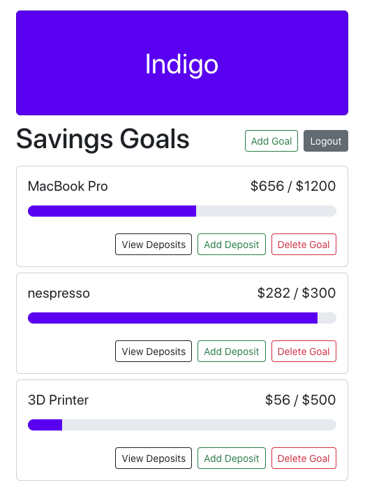

# Indigo

Keep track of your short and long term savings goals by using Indigo, a savings tracker web application! Our program has a progress bar for each goal. All you will need is the goal amount and you start making deposits.

Indigo allows for multiple users to log-in and personalize their own financial goals. Invite your friends and family and try Indigo now!

# Tech Stack:
React.js
HTML/CSS
Google Firebase:
- Firebase Authentication
- Firebase Hosting
- Firestore

# Demo Indigo
1. Go to https://savings-tracker-ada206.web.app
2. Click on "Sign up" if you are a first time user
3. Sign up with your email address and password
4. Click "Add Goal" to create a goal
5. Click "Add Deposits" to add a new deposit. You can visualize your progress below.
6. Click "View Deposits" to see all deposits for specific goal.

